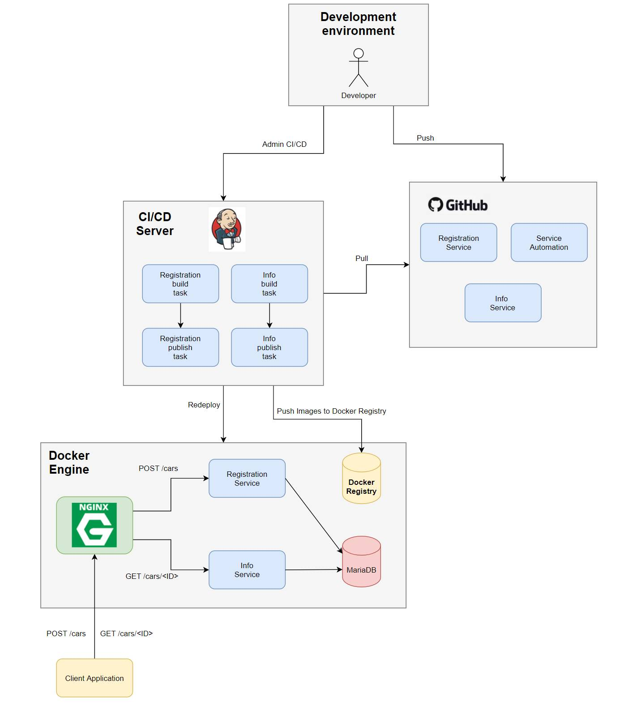

# Exercice 6: CI/CD

This exercice aims to understand the Continious Integration and Continous Delivery/Deployment. 



Three VMs were created, one working as the client, one for the Jenkins and another one with the Docker registry and the service. This document exposes the processes followed to deploy this system, as well as some tips and notes. 

## Jenkins VM
A Jenkins Docker was installed using the following command: 

`sudo docker run -p 8080:8080 -p 50000:50000 --name="jenkinsDocker" -v /var/run/docker.sock:/var/run/docker.sock jenkins/jenkins:lts`

**Note:** It is really important to add the volume (-v) or the Docker won't have the right permissions. 

Once it is deployed, the insecure registry list has to be updated. From both the Jenkins VM and the Docker Registry VM, go to: `/etc/docker/daemon.json` and add the IP from the Docker Registry VM: 
```
{
    "insecure-registries" : [ "192.168.176.144:5000" ]
}
```

Then run: `sudo systemctl daemon-reload` and `systemctl restart docker`. 

Now that Jenkins has been properly set up, it can be accessed through the browser from the VM accessing the localhost:8080. Install the recommended plugins and some additional ones: 
* Docker: All the plugins related to docker.
* Golang
* Git

Then, one has to create two pipelines for each service (post and get): one to scan for any updates in GitHub, and, in case there are any, builds and publishes the image to the repository, and another pipeline to pull and run the uploaded image. In this particular scenario, the following code will reference the post (registration) service, but it can be extrapolated for the get (info) service. 

### Registration Service Multibranch Pipeline
This pipeline was chosen to be multibranch in order to easily enable the source code management from GitHub. The follow configuration was followed:
* Branch Sources: GitHub. Any credentials were added (since the repository is public) and a "discover branches" behavior was added, with an "all branches" strategy. 
* Scan Repository Triggers: the "periodically if not otherwise run" was selected, a 1 minute interval was chosen. 
* The rest of the paremeters were untouched. 

The pipeline source code was uploaded to the repository as a Jenkinsfile, as well as the code for the service (main.go and Dockerfile). 

If everything was configured properly, from now on, everytime the user commits and pushes a modification from the code, this pipeline automatically scans, reads, builds and posts the new image. 

### Registration Publish Pipeline
This pipeline is in charge of, first of all, perform several actions as if it was the Docker Registry VM containing all the services (in reality it is using REST commands to perform this actions. This is why later in this document, in the Docker Registry VM section, docker remote API configurations are changed). This actions are pulling the image from the registry and then running it with the desired configuration. 

From Jenkins web interface, a simple pipeline was created. Then, a build trigger was added, watching the registration_service/master multibranch pipeline to be successfully built. Once this happens, it executes the code for this pipeline, which it is uploaded to this repository for documentation purposes with the name registration_publish_Jenkinsfile. 

## Docker Registry VM
A docker registry was deployed using the following command: 

`docker run -p 5000:5000 -v /var/run/docker.sock:/var/run/docker.sock --name="docker_registry" registry:2`

From now on, from any local device, on could see the images uploaded in this registry by accessing its 'IP address'/v2/_catalog: 
http://192.168.176.144:5000/v2/_catalog

**Note:** One can easily upload an image to the registry simply by tagging an image with the IP from the regsitry, and then pushing it. For example: 

`docker tag post:v1.0 192.168.176.144:5000/post1:latest`

`docker push 192.168.176.144:5000/post1:latest`

In final stages of the exercice, in order to be able to connect to this VM to perform the pull and run commands, one must enable the remote docker API, which is explained in the following link: https://blog.usejournal.com/how-to-enable-docker-remote-api-on-docker-host-7b73bd3278c6

Once everything is properly configured, some manual actions need to be done:
* Create a network so that the containers can communicate between them.
* Manually deploy the MariaDB and Nginx services.
* Run the Post and Get containers, since the pipeline will always first try to stop and remove active containers before running its own one. In case no containers are found, it will give an error. 


