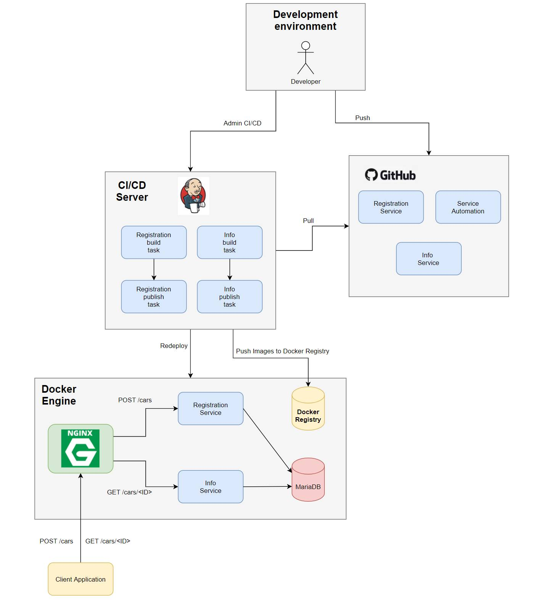

# Exercice 6: CI/CD

This exercice aims to understand the Continious Integration and Continous Delivery/Deployment. 



Three VMs were created, one working as the client, one for the Jenkins and another one with the Docker registry and the service.

## Jenkins VM
A Jenkins Docker was installed using the following command: 

`sudo docker run -p 8080:8080 -p 50000:50000 --name="jenkinsDocker" -v /var/run/docker.sock:/var/run/docker.sock jenkins/jenkins:lts`

**Note:** It is really important to add the volume (-v) or the Docker won't have the right permissions. 

Once it is deployed, the insecure registry list has to be updated. From both the Jenkins VM and the Docker Registry VM, go to: `/etc/docker/daemon.json` and add the IP from the Docker Registry VM: 
```
{
    "insecure-registries" : [ "192.168.176.144:5000" ]
}
```


Then run: `sudo systemctl daemon-reload` and `systemctl restart docker`. 
